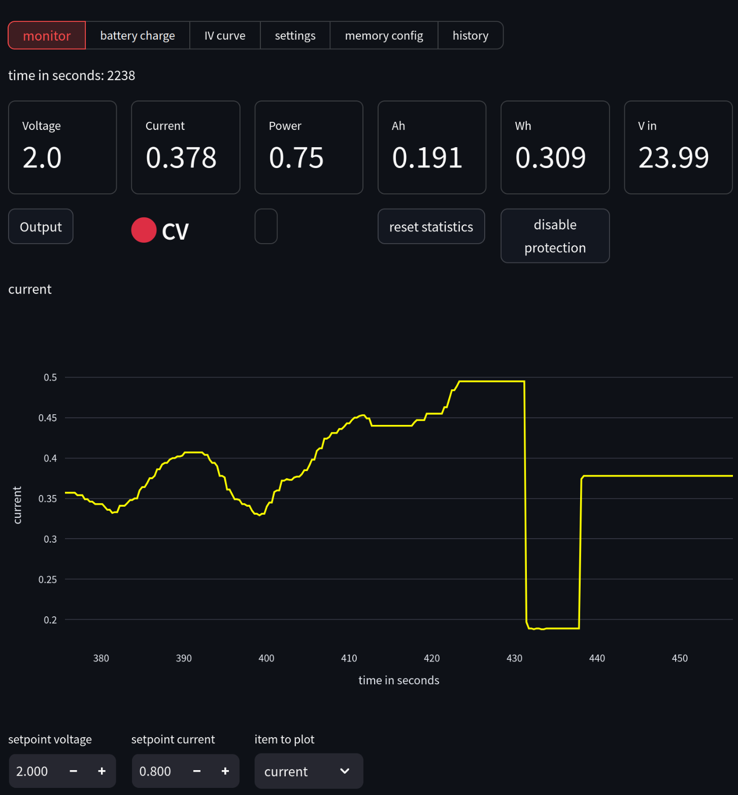

# SK120 power supply module control

*[Streamlit App](https://streamlit.io/) to control the cheap chinese XY-SK120 120W power modules*

*The app is far from finished. Malfunction may damage the device connected to the SK120! Please test and use at your own risk!*

## introduction

The xy-sk120 module is very flexible and capable power supply regulator module. You must supply a DC voltage between 6-36V and the device can output voltages between 0-36V (up and down conversion). The power limits are 6A and 120W max.  It works as a standalone module, but it also features a modbus TTL interface. A regular 5V TTL usb serial adapter can be used to communicate with the device. There is a 4pin JST 1.25mm connector for this (-> hardware.md). There are other variations of this device with lesser and higher power specs that likely use a very similar firmware as the sk120. The information about the comunication protocol is scattered around the net. My starting point was this [project on github ](https://github.com/lambcutlet/DPS5005_pyGUI) which was made for a different model but has a very similar firmware.

## gui

The web gui features several operation modes and allows to configure most of the sk120 settings. Not all modes are yet implement (battery and iv curve are missing). 

features:

- view and interact using most settings

- record and plot voltage, current, power, Ah, Wh, Vin, Temperature as a function of time

- Save history as csv file

- easy, one button resetting of the device values (time,Ah,Wh)

monitor mode to interact live with the psu. 

configure  advanced and protection settings
