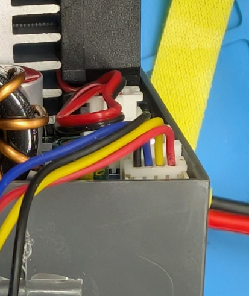

## sk120 hardware

## serial com connector

1.25mm JST connector:
pinout : Gnd (blk), Tx(y), Rx(b),5V(red)

There is no need for a special Modbus interface. A standard RS232 5V TTL-serial usb connector works well at 115200 baudrate! 

## external temperatur sensor

There is another JST 2.54mm connector for the NTC 10k sensor. Works for me. 

## observations

- My device behaves a little odd when it transitions between CV and CC. There are small jumps in the voltage and current readings of the sk120. There are not dramatic and I have yet not tested if it is a display/measurement error of it is really in the output. 

- I could calibrate the output voltage very well, but the current reading is off quite a bit (~10%), while the actual output is accurate. 

- 

